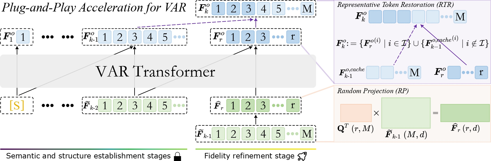

<div align="center">
<h1> 🌟 FasterVAR </h1>
<h3>Plug-and-Play Acceleration for Visual Autoregressive Models</h3>

[](https://arxiv.org/abs/2512.16483) [](https://arxiv.org/pdf/2512.16483) [](https://drive.google.com/file/d/1HaEjwjQBKxZy4CW-IWI32Xjth050ToJU/view?usp=sharing) [](https://drive.google.com/file/d/14xb1MEefT5tI-6cXO0r8UHUNo-teNdQR/view?usp=sharing) 


[Senmao Li](https://sen-mao.github.io/)<sup>1,3</sup>, [Kai Wang](https://wangkai930418.github.io/)<sup>2</sup>,
[Salman Khan](https://salman-h-khan.github.io/)<sup>3</sup>, [Fahad Shahbaz Khan](https://sites.google.com/view/fahadkhans/home)<sup>3,4</sup>, 
[Jian Yang](https://scholar.google.com/citations?user=6CIDtZQAAAAJ&hl=zh-CN)<sup>1</sup>, [Yaxing Wang](https://yaxingwang.github.io/)<sup>1</sup>

<sup>1</sup> Nankai University, <sup>2</sup> City University of Hong Kong (Dongguan), China, <sup>3</sup> MBZUAI, <sup>4</sup> Linkoping University
</div>

<p align="center">
    
</p>

<div align="center">
    
    <br>
    <em>Figure 1. Overview of the proposed FasterVAR framework. We retain the original VAR inference process for the semantic and structure establishment stages, while exploiting semantic irrelevance and low-rank properties in the fidelity refinement stage to accelerate inference.</em>
</div>


## 🖼️ Qualitative Results

<div align="center">
    
    <br>
    <em>Figure 2. Qualitative comparison with the vanilla Infinity-2B, Infinity-8B, and STAR models (1st, 3rd, and 5th rows). Our FasterVAR (2nd, 4th, and 6th rows) achieves a 3.4x, 2.7x, and 1.74x speedup while maintaining performance.</em>
</div>


## 📊 Quantitative Results 

<details>
<summary>Quantitative Results on the GenEval and DPG benchmarks</summary>

<p align="center">
  
</p>
</details>

## 🚀 Accelerated for Text-to-Image generation

**Infinity**
```bash
cd ./Infinity
python tools/interactive_infer.py
```

**STAR**

```bash
cd ./STAR-T2I
python sample.py --model_path taocrayon/STAR/star_rope_d30_1024_drop_3-ar-ckpt-ep1-iter21000.pth \
                 --text_model_path taocrayon/STAR/CLIP \
                 --vae_path FoundationVision/var/vae_ch160v4096z32.pth
```

**HART**

```bash
cd ./hart
python sample_fastervar.py --model_path mit-han-lab/hart-0.7b-1024px/llm \
                           --text_model_path mit-han-lab/Qwen2-VL-1.5B-Instruct  \
                           --shield_model_path mit-han-lab/hart-0.7b-1024px \
                           --prompt "A cinematic shot of robot with colorful feathers"
```


## 📄 Citation

Please cite our paper if you find this work useful for your research:

```bibtex
@inproceedings{li2026icml,
  title     = {FasterVAR: Plug-and-Play Acceleration for Visual Autoregressive Models},
  author    = {Li, Senmao and Wang, Kai and Khan, Salman and Khan, Fahad Shahbaz and Yang, Jian and Wang, Yaxing},
  booktitle = {ICML},
  year      = {2026},
}
```

:star: If FasterVAR is helpful to your projects, please help star this repo. Thanks! :hugs:
